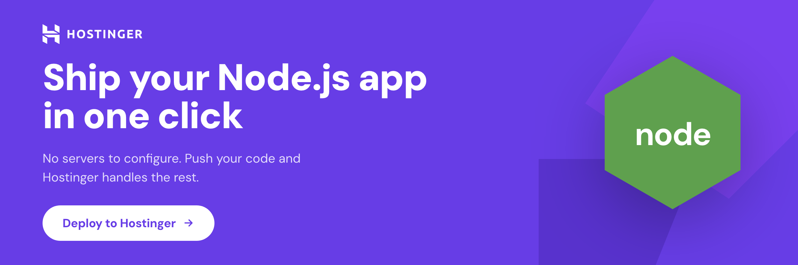

# 📱 MJChatSyncs — Premium Self-Hostable WhatsApp® CRM & Marketing Automation

> **Fork it, brand it, host it, own it.**  
> A premium, fully self-hostable, production-ready WhatsApp® Business API CRM. Featuring a multi-agent shared inbox, automated contact segmentation, multi-stage sales pipelines, broadcast messaging, visual no-code automations, AI chatbot/router integration, and dynamic website chat widgets. **Zero seat limits, zero subscription fees.**

<p align="center">
  <a href="https://www.hostinger.com/web-apps-hosting">
    
  </a>
</p>

[](./LICENSE)
[](https://github.com/AshishKmj/MJChatSyncs/actions/workflows/ci.yml)
[](https://nextjs.org)
[](https://supabase.com)
[](https://github.com/AshishKmj/MJChatSyncs/stargazers)
[](https://github.com/AshishKmj/MJChatSyncs/network/members)

This repo is the product — clone or fork it to run your own CRM.

## What you get out of the box

- **Shared inbox** on the official WhatsApp Business API — multiple agents working one number, per-conversation assignment, status, and notes.
- **Contacts + tags + custom fields**, CSV import, deduplication.
- **Sales pipelines** (Kanban) with deals linked to conversations.
- **Broadcasts** with Meta-approved templates, delivery + read tracking, per-recipient variable substitution.
- **No-code automations** — triggers on inbound messages, new contacts, keywords, or schedule; conditional branches, waits, tags, webhooks. Visual builder.
- **Real-time dashboard** — response times, daily volume, pipeline value, cross-module activity feed.
- **Team accounts** — invite teammates by link, role-based access (owner / admin / agent / viewer), ownership transfer. Every install is account-scoped, so one shared inbox can be staffed by a whole team. Solo use stays single-user with zero setup.
- **Account management** — email, password, avatar, global sign-out.
- **Public REST API** (`/api/v1`) with scoped, revocable API keys — build your own automations on top of your CRM. See [docs/public-api.md](./docs/public-api.md).

## Why fork this?

This is a **template**, not a product. Forking means you get:

- **Full ownership** — your code, your Supabase project, your domain, your data. No SaaS lock-in, no seat pricing, no trust dance.
- **Full customisation** — add the fields your team needs, remove the modules you don't, redesign anything. The stack is boring on purpose (Next.js + Supabase + Tailwind) so the learning curve is short.
- **Zero ops to start** — [Hostinger](https://www.hostinger.com/web-apps-hosting) Managed Node.js deploys a fork in a few clicks. No Docker, no Kubernetes, no infra team needed. ([See below ↓](#-deploy-on-hostinger-recommended))
- **Real security primitives** — token encryption (AES-256-GCM), RLS on every table, HMAC-verified webhooks, CSP, rate limiting, CI typecheck/build on every PR.

Not a framework. Not an SDK. A concrete, working CRM you can stand up in an afternoon and make yours.

## Quick start

```bash
# Fork on GitHub first: https://github.com/AshishKmj/MJChatSyncs → Fork
git clone https://github.com/<your-username>/MJChatSyncs.git
cd MJChatSyncs
npm install
cp .env.local.example .env.local   # fill in Supabase + Meta creds
npm run dev
```

Open <http://localhost:3000>. You'll be redirected to `/login` (or `/dashboard` if already signed in).

## 🚀 Deploy on Hostinger (recommended)

<p align="center">
  <a href="https://www.hostinger.com/web-apps-hosting">
    
  </a>
</p>
<p align="center">
  <a href="./docs/deployment.md">
    
  </a>
</p>

**MJChatSyncs is built to run on [Hostinger](https://www.hostinger.com/web-apps-hosting).**
It's the path we test, document, and recommend — and the fastest way to get a production-grade CRM live without owning a VPS or a Kubernetes cluster.

### Why Hostinger?

| | |
|---|---|
| **One-click Git deploy** | Connect your fork, push to `main`, Hostinger builds and ships it. No SSH, no Docker, no CI to wire up — this repo's own `main` deploys this way. |
| **Managed Node.js** | Next.js 16 (App Router, server actions, ISR) runs out of the box on [Premium, Business, and Cloud](https://www.hostinger.com/web-apps-hosting) shared plans. You don't manage Node versions, processes, or reverse proxies. |
| **Free SSL + free domain** | Automatic Let's Encrypt on your custom domain (or a free one included with annual plans). HTTPS is on by default — required for the WhatsApp Business webhook. |
| **Global CDN + LiteSpeed** | Static assets cached at the edge, dynamic routes served from LiteSpeed. Snappy dashboards out of the box, no Cloudflare setup required. |
| **Env vars + logs in hPanel** | Set `SUPABASE_*`, `WHATSAPP_*`, and `ENCRYPTION_KEY` from the panel — no `.env` on the server. Live application logs in the same UI. |
| **DDoS protection + daily backups** | Built-in, no add-ons. The webhook endpoint is a public target — having protection at the edge matters. |
| **Cheaper than a VPS** | Plans start at a few dollars a month — order-of-magnitude less than a comparable managed Node.js host, and you don't pay extra for the database (that's Supabase). |
| **24/7 human support** | Live chat support in 20+ languages — useful when your CRM is the thing your team relies on to talk to customers. |

### The 60-second version

1. **Fork** this repo on GitHub.
2. In **hPanel → Websites → Create**, pick **Node.js** and connect your fork.
3. Paste your Supabase + Meta env vars into hPanel.
4. Push to `main`. Hostinger builds and serves it. Done.

Full walkthrough with screenshots:
**[docs/deployment.md](./docs/deployment.md)**.

> _Note: MJChatSyncs is MIT-licensed and runs anywhere Node.js does (Vercel, Railway, your own VPS). Hostinger is recommended, not required._

## Documentation

Full self-host documentation — Supabase migrations, WhatsApp Business API config, and production deploy — lives in the `docs/` directory:
- [Getting started / Deployment](./docs/deployment.md)
- [Public API Reference](./docs/public-api.md)
- [Workflow Architecture](./docs/workflow-architecture.md)

## Stack

- **App** — Next.js 16 (App Router), React 19, TypeScript, Tailwind v4.
- **Data** — Supabase (Postgres + Auth + Storage + RLS).
- **WhatsApp** — Meta Cloud API (official WhatsApp Business API).

## Contributing

This is a template, not a collaborative product — the expected flow is fork → customise → deploy, **not** upstream contribution. Bug reports and security issues are welcome; feature PRs often belong in your fork rather than here. Details in [`CONTRIBUTING.md`](./CONTRIBUTING.md) and [`.github/SECURITY.md`](./.github/SECURITY.md).

## License

[MIT](./LICENSE). Fork it, brand it, host it.

---

## 🚀 Step-by-Step Developer Build Guide

Follow this guide to clone, customize, build, and deploy your personal copy of MJChatSyncs.

### 📋 1. Prerequisites
Before beginning, make sure you have:
1.  **Node.js**: `v20.0.0` or higher installed. Check with `node -v`.
2.  **Git**: Installed on your system.
3.  **Supabase Account**: A free or paid instance at [supabase.com](https://supabase.com).
4.  **Meta Developer Portal Account**: Sign up at [developers.facebook.com](https://developers.facebook.com).

---

### 💾 2. Local Setup & Configuration

#### Step A: Clone the Repository
Open a terminal and clone your repository fork:
```bash
git clone https://github.com/<your-username>/MJChatSyncs.git
cd MJChatSyncs
```

#### Step B: Install dependencies
Install required node packages cleanly:
```bash
npm install
```

#### Step C: Configure the Environment Variables
Copy the reference environment template file to create a local parameters file:
```bash
cp .env.local.example .env.local
```

Open `.env.local` inside your text editor. Fill in the values:
```env
# =========================================================================
# NEXT_PUBLIC VARIABLES (EXPOSED TO BROWSER CLIENT)
# =========================================================================

# 1. Supabase Connection Credentials (Found in Supabase Project Settings > API)
NEXT_PUBLIC_SUPABASE_URL=https://your-project-reference.supabase.co
NEXT_PUBLIC_SUPABASE_ANON_KEY=eyJhbGciOiJIUzI1NiIsInR5cCI6IkpXVCJ9.your-anon-key

# =========================================================================
# SERVER-SIDE SECRETS (NEVER EXPOSED TO BROWSER CLIENT)
# =========================================================================

# 2. Supabase Service Role Key (Used for bypassing Row-Level Security on Server actions)
SUPABASE_SERVICE_ROLE_KEY=eyJhbGciOiJIUzI1NiIsInR5cCI6IkpXVCJ9.your-service-role-key

# 3. Access Token Encryption Key (Used for AES-256-GCM token storage)
# MUST BE A 64-CHARACTER HEXADECIMAL STRING (32 BYTES)
# Generate a secure key in your terminal using: openssl rand -hex 32
ENCRYPTION_KEY=9a15a819b5d2906df071d2b86ab20c5ee9ad3cbcd72ab012c45ee9234abc12df
```

> [!WARNING]
> Do NOT skip generating the `ENCRYPTION_KEY`. Standard string keys will crash the server. Generate a strict 64-character hexadecimal key using the terminal command:
> `openssl rand -hex 32`

#### Step D: Spin Up Development Server
Run the Turbopack dev compiler:
```bash
npm run dev
```
Open [http://localhost:3000](http://localhost:3000) inside your web browser. The app compiles instantly!

---

### 🗄️ 3. Supabase Cloud Database Provisioning

All structural schemas, tables, triggers, and Row-Level Security (RLS) policies are pre-packaged as SQL files inside `supabase/migrations`.

#### Option A: Deploying via Supabase CLI (Recommended)
1.  Install the Supabase CLI locally and log in:
    ```bash
    npx supabase login
    ```
2.  Link your local directory with your Supabase cloud project:
    ```bash
    npx supabase link --project-ref <your-project-reference-id>
    ```
3.  Push all database schema migrations to the cloud DB:
    ```bash
    npx supabase db push
    ```

#### Option B: Deploying manually via Supabase SQL Editor
If you prefer to bypass the CLI:
1.  Open [Supabase dashboard](https://supabase.com).
2.  Navigate to your project, click the **SQL Editor** tab from the sidebar.
3.  Create a new query, open `supabase/migrations/001_initial_schema.sql` in your editor, copy the contents, and paste them into the SQL Editor. Click **Run**.
4.  Repeat this process in order (from `002_` to `019_ai_router_config.sql`) to ensure all tables, functions, and columns are fully initialized.

---

### 📱 4. WhatsApp Cloud API Connection Setup

To link your physical WhatsApp Business Number or a Meta Sandbox testing line with the MJChatSyncs dashboard, follow these steps:

#### Step A: Create your Facebook Developer App
1.  Log in to [Meta Developers Console](https://developers.facebook.com/).
2.  Click **Create App** in the top-right corner.
3.  Select **Other > Business** or **WhatsApp** as the app type and input an app name.
4.  Once created, scroll down the App Dashboard and click **Set Up** next to the **WhatsApp** product.

#### Step B: Obtain a Permanent System User Access Token
By default, the token in the Meta Developers console expires every 24 hours. To generate a permanent one:
1.  Go to your **Meta Business Manager Suite** settings (`business.facebook.com`).
2.  Navigate to **Users > System Users**. Create a new System User (assign **Admin** role).
3.  Click **Add Assets**, select your newly created Meta App, and grant it **Full Control** permissions.
4.  Click **Generate New Token**, select your app, check the **`whatsapp_business_messaging`** and **`whatsapp_business_management`** permission checkboxes, and click **Generate**.
5.  Copy this token and store it securely. **This token will never expire.**

#### Step C: Connect and Test inside MJChatSyncs
1.  Log into your MJChatSyncs panel and navigate to **Settings > WhatsApp Configuration**.
2.  Click **Connect WhatsApp Number**.
3.  Input your details:
    *   **Phone Number ID**: Found in Meta Developer console (WhatsApp > API Setup).
    *   **WhatsApp Business Account ID**: Found in Meta Developer console (WhatsApp > API Setup).
    *   **System Access Token**: Paste the permanent token generated in **Step B**.
4.  Save the card.
5.  Click the **Test API Connection** button on your number's dashboard card to verify connection health instantly.

#### Step D: Connect Inbound Webhooks
To receive live customer chats in your CRM inbox:
1.  In your Meta App dashboard, navigate to the sidebar and click **WhatsApp > Configuration**.
2.  Under **Webhook**, click **Edit**.
3.  Set the fields:
    *   **Callback URL**: `https://your-public-domain.com/api/whatsapp/webhook`
    *   **Verify Token**: Set a custom secure string of your choosing (e.g. `MySecureMJChatSyncsToken123!`).
    *   On the Meta Developers page, scroll to **Webhook Fields**, click **Manage**, find the **`messages`** row, and click **Subscribe**.
4.  Send a WhatsApp text from a separate phone to your registered Business API number. The message will appear in your live CRM shared inbox instantly!

---

## 🛡️ Database Tables & Schema Overview

To help you custom-build features on top of MJChatSyncs, here is a breakdown of the primary database tables created during migrations:

| Table Name | Primary Purpose | Key Fields |
| :--- | :--- | :--- |
| `profiles` | Stores agent metadata, roles, and UI permission scopes. | `user_id`, `role`, `permissions` (JSON), `status` |
| `whatsapp_configs` | Stores WhatsApp API connections and AES-encrypted access tokens. | `phone_number_id`, `phone_number`, `token_encrypted` |
| `ai_router_config` | Stores custom AI endpoint details, routing headers, and system prompt contexts. | `endpoint_url`, `api_key`, `system_prompt`, `is_active` |
| `contacts` | Stores customer records, assigned tags, and pipeline statuses. | `phone`, `name`, `tags` (array), `pipeline_stage_id` |
| `messages` | Realtime ledger storing all sent, received, and read chats. | `wamid`, `sender`, `body`, `type`, `metadata` |
| `pipelines` | Houses multiple pipeline groups (e.g. Sales, Support, Onboarding). | `id`, `name`, `order_index` |
| `pipeline_stages` | Custom Kanban columns belonging to specific pipelines. | `id`, `pipeline_id`, `name`, `color` |
| `automations` | Configured message responders, auto-responders, and flow-states. | `id`, `name`, `trigger_type`, `actions` (JSON) |

---

## 🔒 Security Best Practices
1.  **Restrict the Service Role Key**: Never expose your `SUPABASE_SERVICE_ROLE_KEY` to the browser or push it to public repositories. It bypasses all Postgres row-level security.
2.  **Meta Token Rotation**: Regularly verify and rotate your System User Tokens inside the Meta Business Manager portal.
3.  **Strict Origin RLS**: Apply Row-Level Security policies to limit read/write actions on the `messages` table exclusively to authorized team members.
