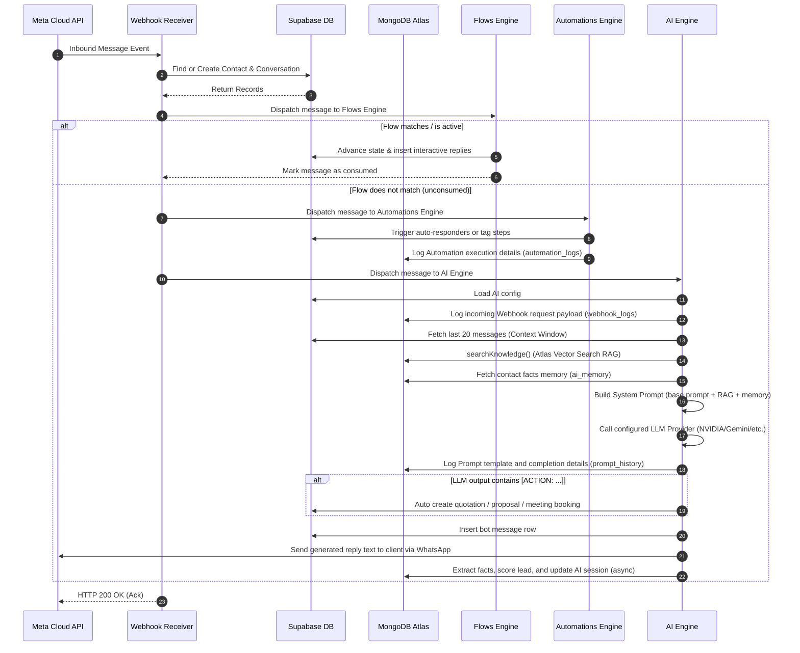
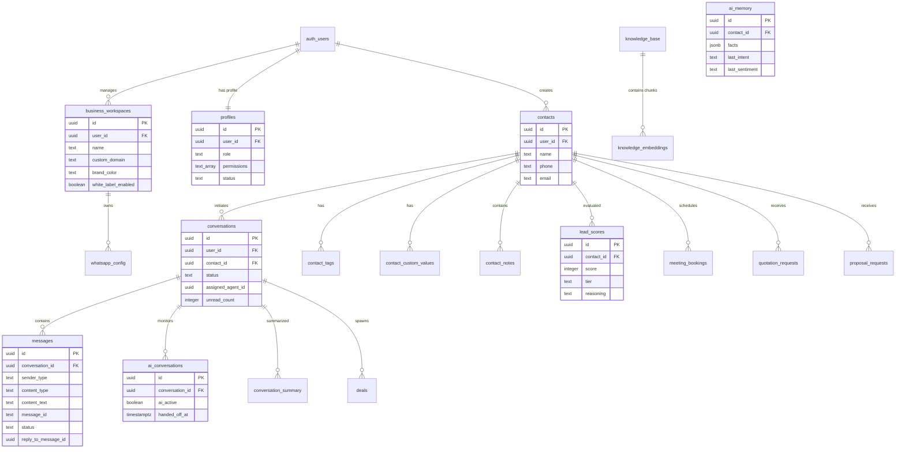

# System Architecture — WaCRM Enterprise

This document describes the high-level architecture, database schemas, and message execution flows of WaCRM Enterprise.

---

## 🌐 High-Level System Architecture

WaCRM operates as a Next.js App Router application hosted on a server or VPS (e.g. Hostinger, Vercel, or a Docker container) linked to a Supabase Postgres database.

```
                  ┌──────────────────────────────┐
                  │   WhatsApp Business Cloud   │
                  └──────────────┬───────────────┘
                                 │
                         HTTP Webhook POST
                                 │
                                 ▼
         ┌────────────────────────────────────────────────┐
         │             WaCRM Webhook Receiver             │
         │   (src/app/api/whatsapp/webhook/route.ts)      │
         └──────────────┬──────────────────┬──────────────┘
                        │                  │
                        │ (Inbound Flow)   │ (Realtime Sync)
                        ▼                  ▼
       ┌───────────────────────────┐ ┌───────────────┐
       │   Automations & Flows     │ │   Supabase    │
       │   Chatbot State Machines  │ │   Realtime    │
       └────────────┬──────────────┘ └───────┬───────┘
                    │                        │
             (If not consumed)               │ (Inbox UI Sync)
                    ▼                        ▼
       ┌───────────────────────────┐ ┌───────────────┐
       │         AI Engine         │ │  Multi-Agent  │
       │  (src/lib/ai/engine.ts)   │ │  Shared Inbox │
       └────────────┬──────────────┘ └───────┬───────┘
                    │
             ┌───────┴───────┬──────────────────────┬──────────────────────┐
             ▼               ▼                      ▼                      ▼
     ┌───────────────┐┌──────────────┐      ┌───────────────┐      ┌───────────────┐
     │ MongoDB Atlas ││ AI Providers │      │  Auto CRM RLS │      │ MongoDB Atlas │
     │  Vector Search││ (NVIDIA,    │      │  Deals, Leads │      │ AI Memory,    │
     │  RAG Engine   ││ Gemini, etc.)│      │  Quotes/Props │      │ Logs, Prompts │
     └───────────────┘└──────────────┘      └───────────────┘      └───────────────┘
```

---

## 🔄 Webhook Inbound Message Pipeline

When a client sends a WhatsApp message to your registered number, the system processes it in a strict, resilient execution pipeline:



---

## 🗄️ Database Schema & Relationships

WaCRM leverages Supabase PostgreSQL with `pgvector` enabled for semantic embeddings. Row-Level Security (RLS) restricts access to tenant workspaces (`business_workspaces` table).



---

## 🍃 MongoDB Atlas Collections & AI Schemas

AI context, embeddings, summaries, prompt templates, and execution audit trails are stored in MongoDB Atlas:

### 1. `knowledge_base`
Stores document metadata fed into the RAG pipeline:
- `id` (string/UUID): Unique reference matching the source file/URL.
- `user_id` (string): Scoped CRM owner.
- `title` (string): Document title or filename.
- `doc_type` (string): Type (`pdf`, `docx`, `txt`, `website`, etc.).
- `content` (string): Raw extracted text content.
- `source_url` (string): Scrape origin for crawled pages.
- `storage_path` (string): Supabase storage bucket file path.
- `status` (string): Process state (`pending`, `processing`, `ready`, `failed`).
- `chunk_count` (number): Number of text vector fragments generated.
- `embedding_model` (string): Identifier of the active LLM embedder.
- `created_at` / `updated_at` (Date)

### 2. `knowledge_embeddings`
Stores text fragments alongside vectors for semantic RAG search:
- `user_id` (string): Scoped owner.
- `knowledge_base_id` (string): Link to parent document.
- `content` (string): Text fragment content.
- `chunk_index` (number): Fractional order of chunk.
- `embedding` (array of numbers): 1024-dimension float vector.
- `metadata` (object): Chunk stats and provider details.

### 3. `ai_memory`
Stores profile summaries extracted from WhatsApp client chats:
- `user_id` (string)
- `contact_id` (string)
- `facts` (object): Key profile keys, e.g., name, company, budget, timeline, business goals.
- `last_intent` (string): Intent type (complaint, booking, pricing, etc.).
- `last_sentiment` (string): Neutral, positive, or negative.
- `last_language` (string): Customer language code (e.g., `en`, `es`, `hi`).
- `total_interactions` (number)

### 4. `ai_conversations`
Tracks the active state of LLM chats:
- `conversation_id` (string)
- `user_id` (string)
- `total_ai_messages` (number)
- `ai_active` (boolean)
- `handed_off_at` (Date/null)
- `provider` / `model` (string)

### 5. `ai_usage_logs`
Tracks LLM token counts and costs:
- `user_id` (string)
- `conversation_id` (string)
- `contact_id` (string)
- `operation` (string): chat, embed, summary, intent, etc.
- `provider` / `model` (string)
- `total_tokens` (number)
- `confidence` (number)
- `finish_reason` (string)

### 6. Audit Logs (`webhook_logs`, `automation_logs`, `prompt_history`)
Maintains operational traces:
- `webhook_logs`: records inbound webhook payloads and delivery statuses.
- `automation_logs`: records executing triggers, nodes reached, and errors.
- `prompt_history`: stores prompt messages, outputs, and latency times (ms).

---


## 🔒 Enterprise Security Measures

1.  **Row Level Security (RLS)**: Every database query is scoped to the authenticated user's `user_id` or workspace using Postgres RLS policies.
2.  **API Token Encryption**: WhatsApp user access tokens are encrypted in the database using `AES-256-GCM` before storage, preventing token compromise even if read-access is leaked.
3.  **Webhook Validation**: Incoming webhook calls from Meta are HMAC-SHA256 verified against `META_APP_SECRET`.
4.  **Handoff Interceptor**: The AI Engine enforces a confidence threshold. If a response confidence drops below the margin, the system ceases bot responses, alerts the agents, and triggers the `handed_off` state.
