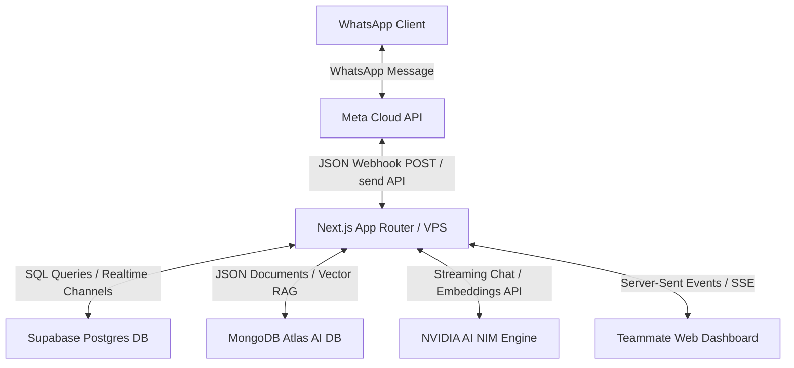
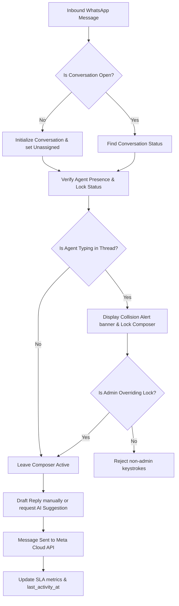
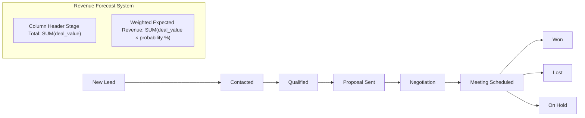
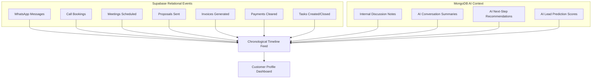
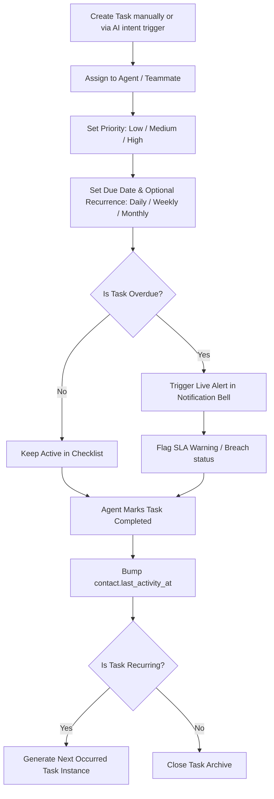

# Enterprise CRM Module Documentation — WaCRM

This comprehensive reference manual documents the design, data flows, permission configurations, database architecture, and extension interfaces for the WaCRM Enterprise CRM modules.

---

## 1. CRM Architecture Diagram
The high-level integration diagram below shows how the Next.js App Router synchronizes activities in real time between the Meta WhatsApp Cloud API, Supabase (relational CRM operations), MongoDB Atlas (AI context, memory, and analytics), and the NVIDIA AI NIM engine.



---

## 2. Inbox Flow
The inbox routing system governs how a message is received, checked for collision triggers, updated for presence, assigned to agents, and resolved.



---

## 3. Lead Pipeline Diagram
The sales pipeline monitors customer progress from acquisition to deal closing, integrating weighted revenue calculations (Value × Probability) per stage.



---

## 4. Customer Timeline Diagram
The unified activity timeline aggregates relational business logs from Supabase and semantic AI intelligence from MongoDB, compiling them into a single chronological feed.



---

## 5. Task Flow
The task system automates follow-ups, alerts team members, and tracks completion rates to prevent conversation drift and SLA breaches.



---

## 6. Permission Matrix
WaCRM utilizes Role-Based Access Control (RBAC) to define what pages, controls, and fields team members can view or modify. Below is the default system configuration matrix:

| CRM Module / Action | Super Admin | Admin | Manager | Sales Executive | Support Executive | Marketing | Accountant |
| :--- | :---: | :---: | :---: | :---: | :---: | :---: | :---: |
| **View Shared Inbox** | ✅ | ✅ | ✅ | ✅ | ✅ | ✅ | ❌ |
| **Take Over / Release Chat** | ✅ | ✅ | ✅ | ✅ | ✅ | ❌ | ❌ |
| **Admin Override Lock** | ✅ | ✅ | ❌ | ❌ | ❌ | ❌ | ❌ |
| **Manage Contacts & Tags** | ✅ | ✅ | ✅ | ✅ | ✅ | ✅ | ❌ |
| **View Deal Values & Pipeline**| ✅ | ✅ | ✅ | ✅ | ❌ | ❌ | ✅ |
| **Create Invoices & Payments** | ✅ | ✅ | ✅ | ✅ | ❌ | ❌ | ✅ |
| **Broadcast Campaigns** | ✅ | ✅ | ✅ | ❌ | ❌ | ✅ | ❌ |
| **Modify SLA & CRM Settings** | ✅ | ✅ | ❌ | ❌ | ❌ | ❌ | ❌ |
| **Team Management & RBAC** | ✅ | ✅ | ❌ | ❌ | ❌ | ❌ | ❌ |

---

## 7. Database Schema
The database architecture implements a hybrid model: structured relational transactions are stored in **Supabase (PostgreSQL)**, while semi-structured AI intelligence, conversations vector embeddings, and audit trails reside in **MongoDB Atlas**.

### Supabase Relational Tables
```
Profiles (public.profiles)
 ├── id: UUID (PK)
 ├── user_id: UUID (FK auth.users)
 ├── full_name: TEXT
 ├── role: TEXT
 ├── permissions: TEXT[]
 ├── availability: TEXT ('online', 'busy', 'away')
 └── last_seen_at: TIMESTAMPTZ

Contacts (public.contacts)
 ├── id: UUID (PK)
 ├── owner_id: UUID (FK profiles)
 ├── name: TEXT
 ├── phone: TEXT
 ├── email: TEXT
 ├── company: TEXT
 ├── website: TEXT
 ├── industry: TEXT
 ├── address: TEXT
 ├── city: TEXT
 ├── state: TEXT
 ├── country: TEXT
 ├── timezone: TEXT
 ├── lead_source: TEXT
 ├── status: TEXT
 ├── last_activity_at: TIMESTAMPTZ
 └── preferred_language: TEXT

Invoices (public.invoices)
 ├── id: UUID (PK)
 ├── contact_id: UUID (FK contacts)
 ├── invoice_number: TEXT (Unique)
 ├── amount: NUMERIC(12,2)
 ├── status: TEXT ('draft', 'sent', 'paid', 'overdue', 'cancelled')
 ├── due_date: TIMESTAMPTZ
 └── services: TEXT[]

Payments (public.payments)
 ├── id: UUID (PK)
 ├── contact_id: UUID (FK contacts)
 ├── invoice_id: UUID (FK invoices)
 ├── amount: NUMERIC(12,2)
 ├── payment_method: TEXT
 ├── transaction_id: TEXT
 └── status: TEXT ('pending', 'completed', 'failed')

Tasks (public.tasks)
 ├── id: UUID (PK)
 ├── contact_id: UUID (FK contacts)
 ├── assigned_to: UUID (FK profiles)
 ├── title: TEXT
 ├── priority: TEXT ('low', 'medium', 'high')
 ├── due_date: TIMESTAMPTZ
 ├── status: TEXT ('pending', 'completed')
 └── recurring: TEXT ('daily', 'weekly', 'monthly')
```

### MongoDB Atlas Collections
```
ai_memory (Contact Facts)
 ├── _id: ObjectId
 ├── user_id: String (UUID)
 ├── contact_id: String (UUID)
 ├── facts: Document (company, budget, goals, pain_points)
 ├── last_intent: String
 └── last_sentiment: String

ai_conversations (Active Bot Sessions)
 ├── _id: ObjectId
 ├── conversation_id: String (UUID)
 ├── ai_active: Boolean
 ├── provider: String
 └── model: String

prompt_history (AI Completions Audits)
 ├── _id: ObjectId
 ├── user_id: String
 ├── conversation_id: String
 ├── prompt_text: String
 ├── response_text: String
 └── tokens_used: Integer
```

---

## 8. API Documentation
The Enterprise CRM exposes serverless API endpoints to power the AI suggested composer replies, lead qualification, and bulk actions.

### A. Contact Intelligence & Recommendations
Fetches dynamic AI scoring, sentiment analysis, client facts, buying intent, and next-best recommendations on-the-fly via the active NVIDIA model.
*   **Endpoint**: `GET /api/contacts/[id]/intelligence`
*   **Authentication**: Authenticated User Session
*   **Query Params**: None
*   **Response (200 OK)**:
    ```json
    {
      "contact": { "id": "contact-uuid", "name": "John Doe", "status": "qualified" },
      "memory": { "facts": { "budget": "High", "interests": ["SEO Services"] } },
      "summary": { "text": "Customer is seeking custom SEO optimization for a logistics portal." },
      "intelligence": {
        "leadScore": 85,
        "conversionProbability": 75,
        "intent": "Seeking custom enterprise packages with API integration",
        "sentiment": "Positive",
        "buyingSignals": ["Inquired about API support", "Shared technical spec docs"],
        "recommendations": [
          "Send enterprise catalog sheet",
          "Book technical consulting meeting"
        ],
        "customerIntelligence": {
          "painPoints": ["Slow search speeds", "High legacy maintenance costs"],
          "interestedServices": ["Enterprise SEO", "Vite Migrations"],
          "estimatedBudget": "High"
        }
      }
    }
    ```

### B. AI Reply Drafting & Template Recommendations
Exposes the AI Team Assistant drafting pipeline, incorporating RAG context, facts, and matching quick replies shortcuts.
*   **Endpoint**: `POST /api/ai/assist`
*   **Payload**:
    ```json
    {
      "conversationId": "conv-uuid"
    }
    ```
*   **Response (200 OK)**:
    ```json
    {
      "draft": "Hello John, I see you are looking for enterprise SEO packages. We have premium solutions tailored for high-volume logistics platforms. I would love to schedule a quick call to go over the specifications.",
      "recommendedReplies": [
        {
          "id": "qr-uuid-1",
          "shortcut": "/seo",
          "message_text": "Here is our standard SEO pricing catalog: ..."
        }
      ]
    }
    ```

---

## 9. Developer Guide

### A. Real-Time Presence & Collision Detection
The typing indicators and collision warning banners are driven by **Supabase Presence Channels**. On entering a chat thread:
1. The client subscribes to the presence channel: `presence:${conversationId}`.
2. The agent tracks their state, specifying their name and typing status (`typing: boolean`).
3. Whenever a teammate joins the same thread, both clients receive a `sync` event, recalculate the list of other active viewers, and display the collision banner.
4. If a teammate is typing, the composer text area is locked with a warning. Admins or super admins can press the "Admin Override" button to set `overrideLock` to `true`, bypassing the lock.

### B. Weighted expected revenue logic
The forecast numbers in the pipeline board are calculated client-side inside `src/components/pipelines/pipeline-board.tsx`:
```typescript
const stageTotalValue = dealsInStage.reduce((sum, deal) => sum + (Number(deal.value) || 0), 0);
const stageWeightedRevenue = dealsInStage.reduce((sum, deal) => {
  const prob = Number(deal.probability) || 0;
  const val = Number(deal.value) || 0;
  return sum + (val * (prob / 100));
}, 0);
```
This guarantees that pipeline predictions adapt instantly to drag-and-drop actions, pipeline reorderings, or deal value adjustments.

### C. Running Tests & Quality Checks
To keep the codebase stable, developers should run the quality checking suite before submitting any Pull Requests:
```bash
# Run Type Checker (TypeScript)
npm run typecheck

# Run Test Suite (Vitest)
npm run test
```
All new REST routes and helper functions must be supported by unit tests in their respective `.test.ts` files.
